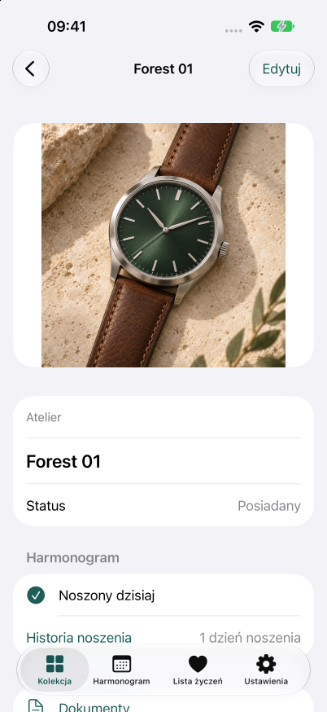
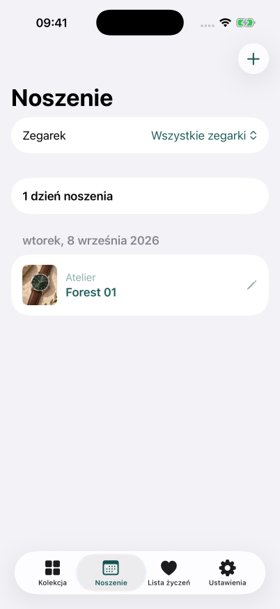
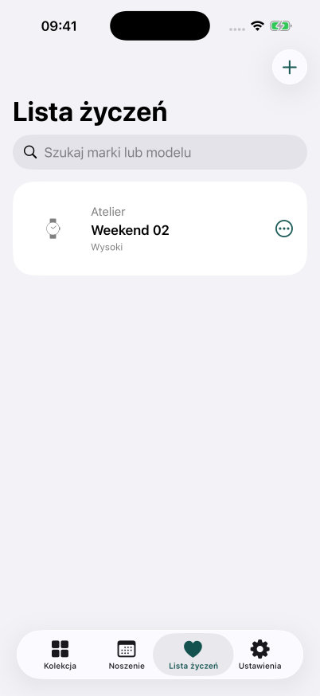
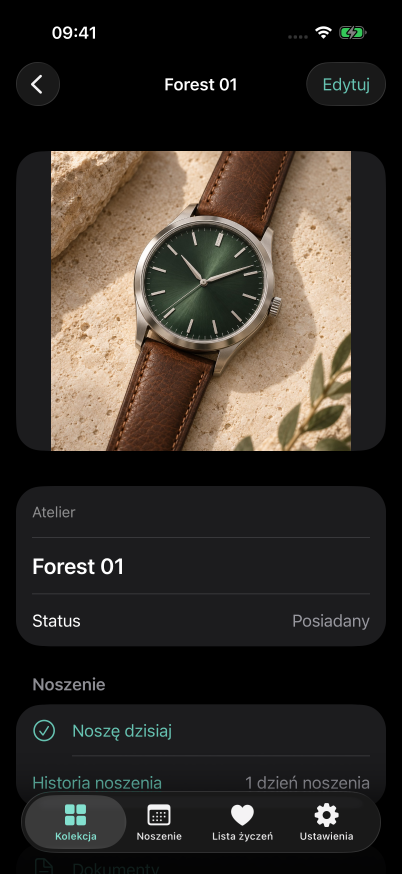
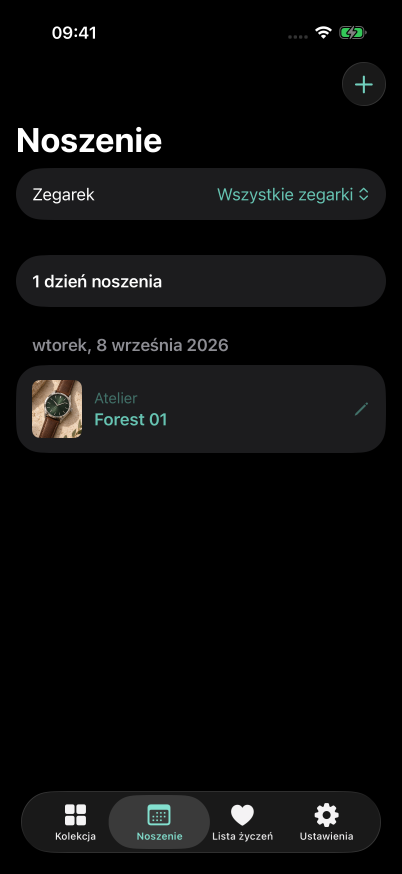
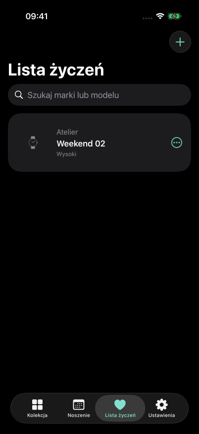

# Moje Zegarki

## Każdy zegarek ma swoją historię. Zapisz ją.

Pierwszy automat, prezent na ważną okazję, ulubiony zegarek na co dzień. **Moje Zegarki** to Twoje prywatne miejsce na kolekcję — ze zdjęciami, wspomnieniami i planami na kolejny zakup. Zawsze pod ręką, na iPhonie.

### W jasnym motywie

| Twoja kolekcja. Twoje historie. | Co dziś na nadgarstku? | Zrób miejsce na marzenia. |
| :---: | :---: | :---: |
|  |  |  |
| Zdjęcia i szczegóły każdego zegarka w jednym miejscu. | Oznacz, co nosisz, i wracaj do historii swojej kolekcji. | Zapisuj wymarzone modele i ustalaj priorytety. |

### W ciemnym motywie

Ta sama kolekcja, historia i plany — w ciemnej oprawie.

| Twoja kolekcja. Twoje historie. | Co dziś na nadgarstku? | Zrób miejsce na marzenia. |
| :---: | :---: | :---: |
|  |  |  |

### Mniej szukania. Więcej przyjemności z kolekcjonowania.

- **Pamiętaj o szczegółach.** Zachowuj numery referencyjne, dane zakupu, notatki i dokumenty PDF lub zdjęciowe przy konkretnym zegarku.
- **Zachowaj całą historię.** Przenoś sprzedane zegarki do Archiwum, razem ze zdjęciami i historią noszenia.
- **Od marzenia do kolekcji.** Gdy kupisz zegarek z listy życzeń, przenieś go do swoich zbiorów.
- **Kolekcjonuj po swojemu.** Bez konta, reklam i połączenia z internetem. Dane pozostają lokalnie; dostęp możesz dodatkowo chronić Face ID lub kodem urządzenia.

**Twoje zegarki. Twój rytm. Twoja kolekcja.**

---

*iPhone · iOS 17 lub nowszy · język polski i angielski. Aplikacja jest w rozwoju, przed publikacją w App Store. Materiał przedstawia obecny lokalny zakres FREE.*

*Autentyczne zrzuty z aplikacji uruchomionej w symulatorze, wykonane 13.09.2026. Nazwy i wpisy są fikcyjnymi danymi demonstracyjnymi; ilustrację zegarka wygenerowano przy użyciu AI i dodano do aplikacji jako zdjęcie. Interfejs screenów nie był retuszowany.*
