# Screeny PL/EN — 0.8.0

Autentyczne zrzuty z buildu 0.8.0 (1), wykonane 17.09.2026 na iPhone 17 Pro Max, iOS 26.5. PNG, **1320 × 2868 px**, pionowo, natywna gęstość 3×. Ten rozmiar znajduje się w kategorii iPhone 6.9″ w [specyfikacji Apple](https://developer.apple.com/help/app-store-connect/reference/app-information/screenshot-specifications).

Nie powiększano obrazów z dokumentacji promocyjnej. Zrzuty powstały bez retuszu interfejsu, z tą samą fikcyjną kolekcją w obu językach. Ilustracja zegarka została wygenerowana przy użyciu AI i zaimportowana do aplikacji jako zdjęcie; nie przedstawia konkretnego produktu. Aplikacja instalowana przez użytkownika ma pustą kolekcję.

Zrzuty dokumentują build 1. Nie obejmują późniejszych zmian Harmonogramu i typografii; przed publikacją sklepową należy je odświeżyć.

## Polski — jasny motyw

| Kolekcja | Harmonogram | Lista życzeń |
| --- | --- | --- |
| 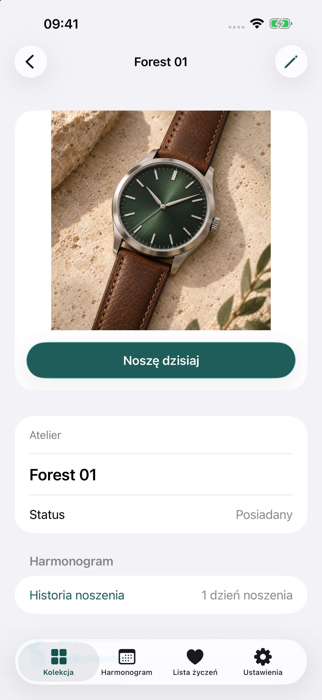 | 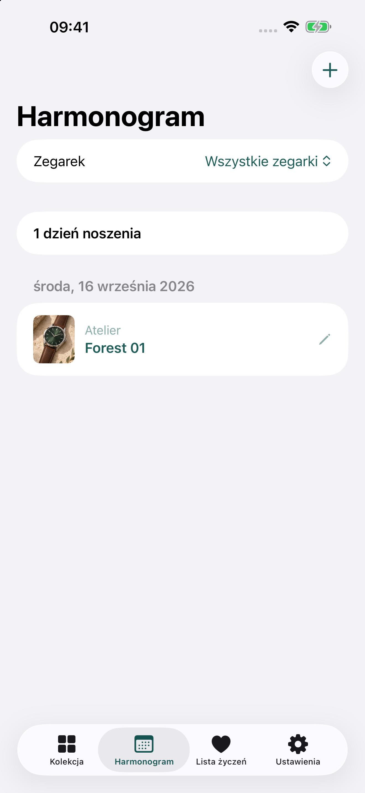 | 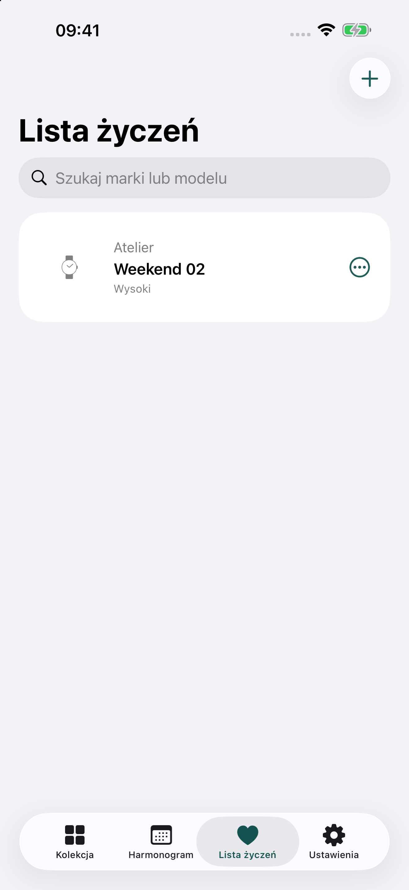 |

## Polski — ciemny motyw

| Kolekcja | Harmonogram | Lista życzeń |
| --- | --- | --- |
|  | 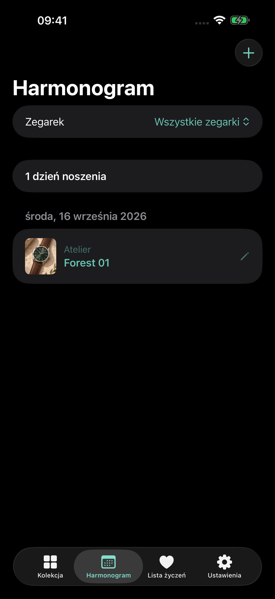 | 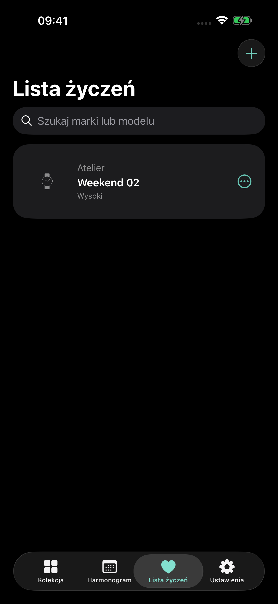 |

## English — light

| Collection | Wearing | Wishlist |
| --- | --- | --- |
| 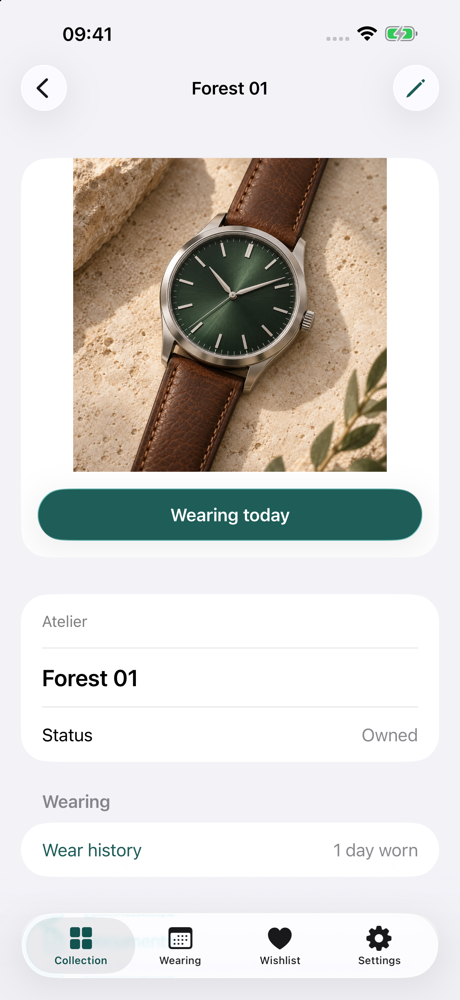 | 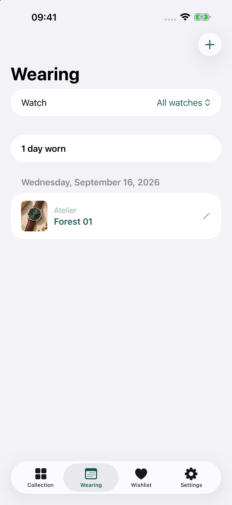 | 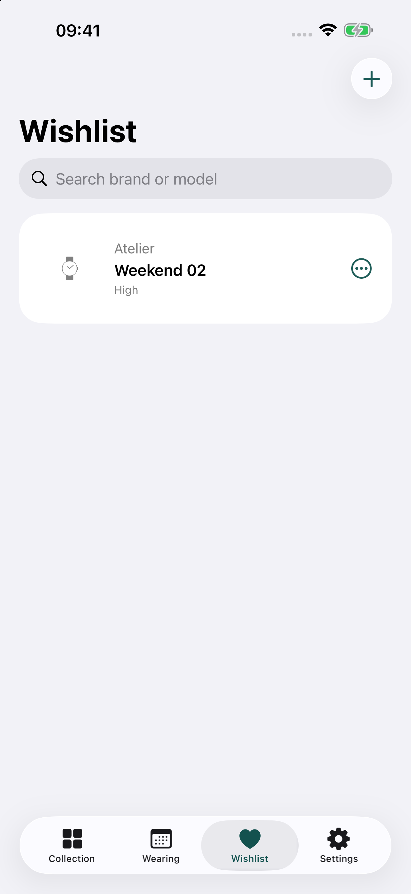 |

## English — dark

| Collection | Wearing | Wishlist |
| --- | --- | --- |
| 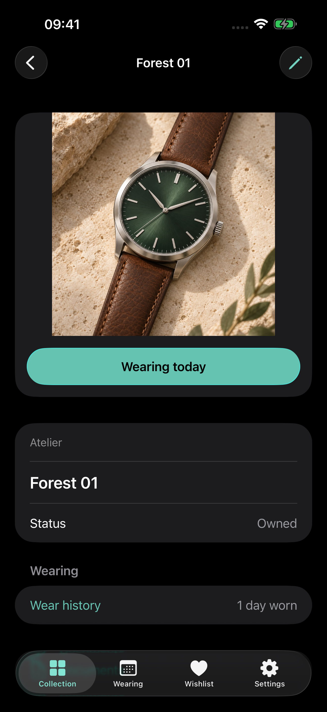 | 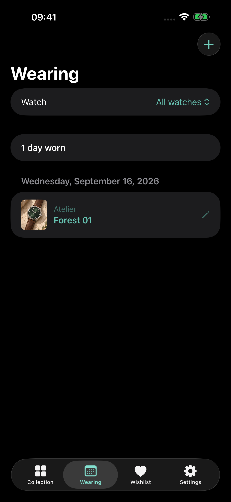 | 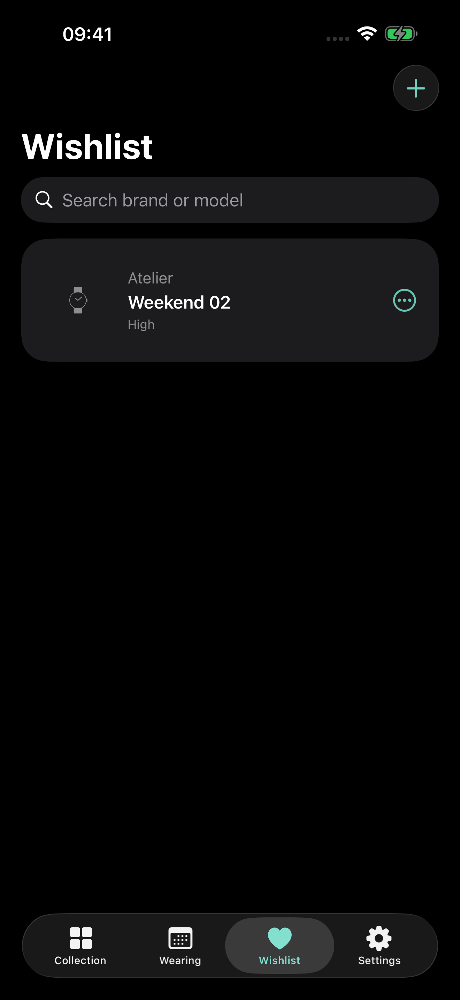 |

## Proponowana kolejność w sklepie

W każdej lokalizacji osobno: `01-watch-light`, `02-wearing-light`, `03-wishlist-light`, następnie trzy odpowiedniki `dark`. Pliki EN umieścić w lokalizacji English (U.S.), PL w Polish. Materiały nie zostały przesłane do App Store Connect.

W pierwszej becie TestFlight nie należy obiecywać wyświetlania tych screenów w zaproszeniu: opcjonalne materiały zaproszenia mogą pochodzić z już zatwierdzonej wersji sklepowej, której aplikacja jeszcze nie ma. [Apple: informacje TestFlight](https://developer.apple.com/help/app-store-connect/test-a-beta-version/provide-test-information/).
